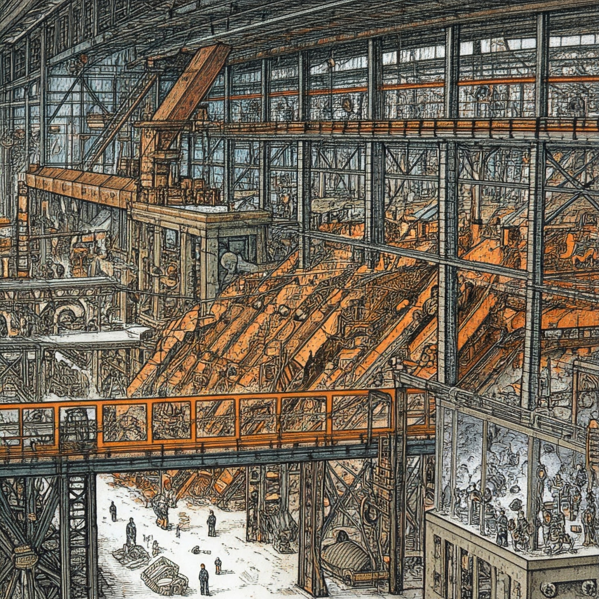
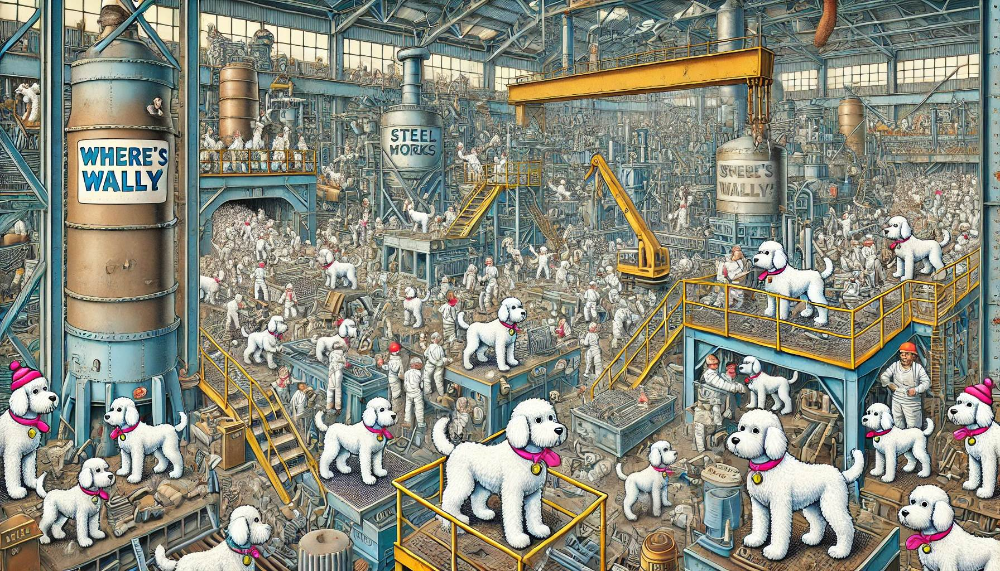
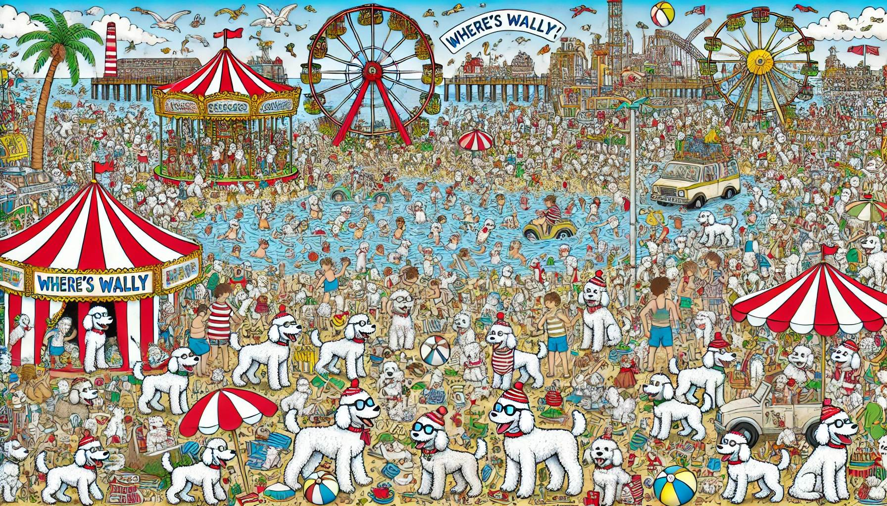
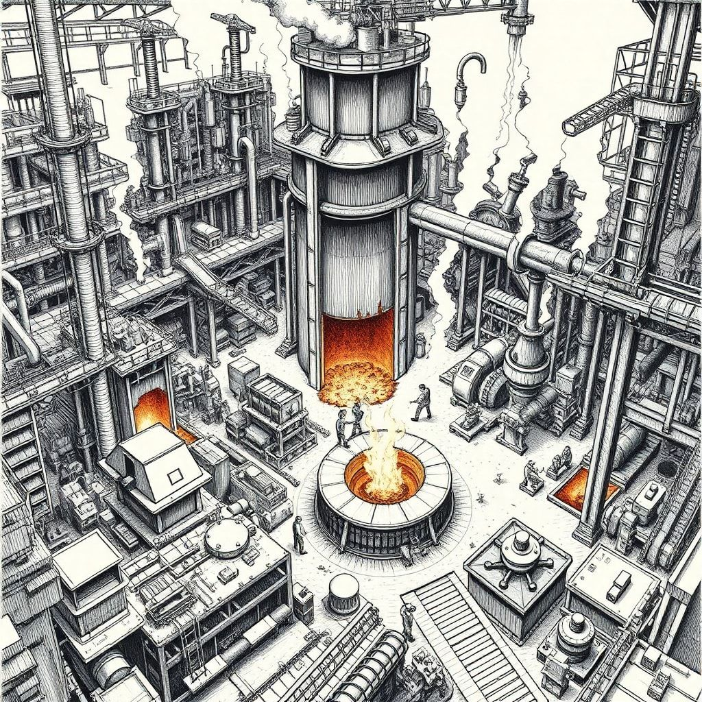
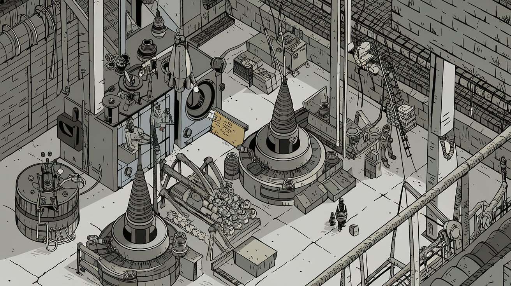
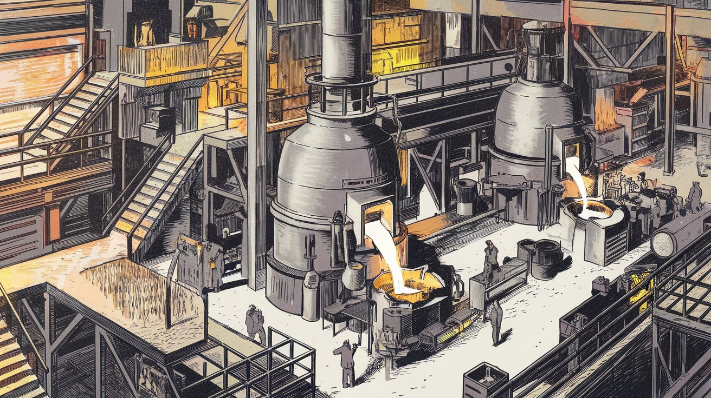
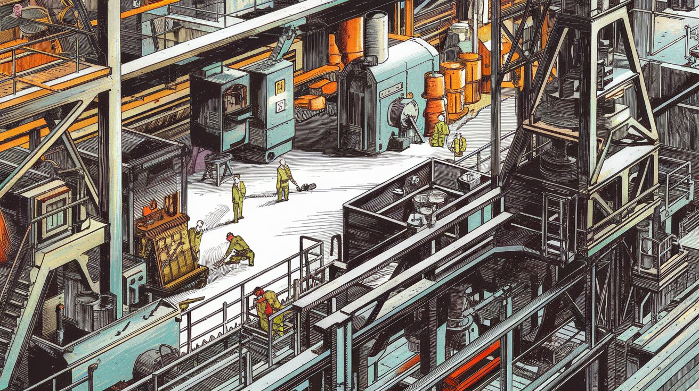
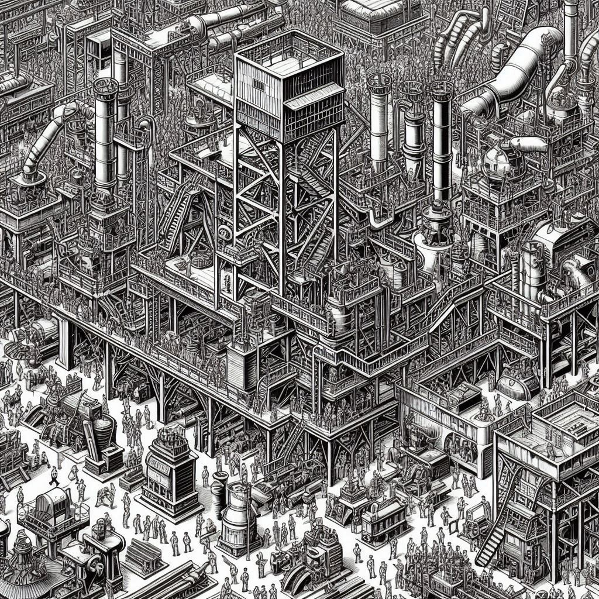
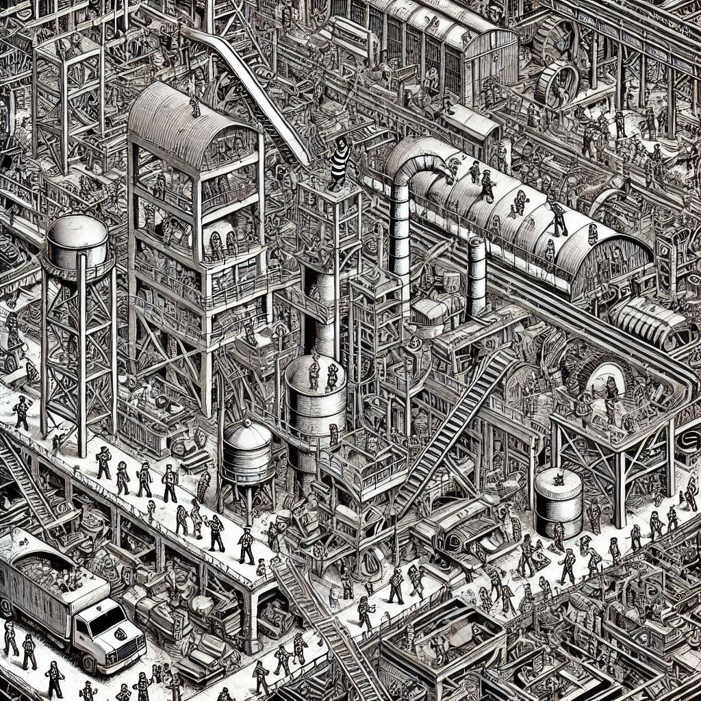
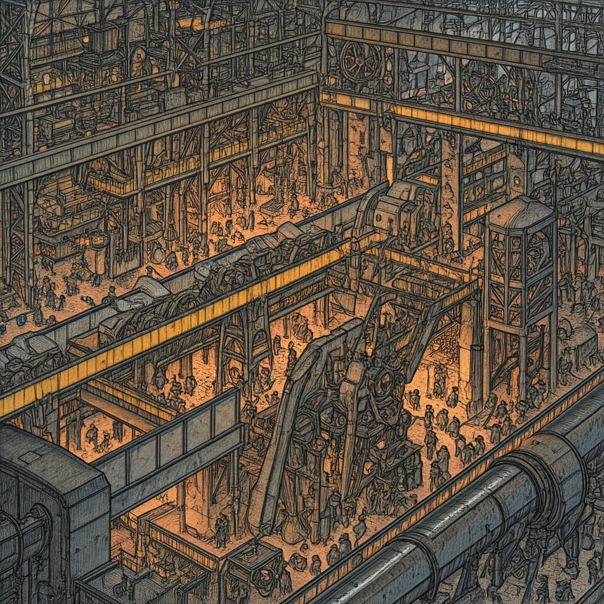

{width=1024px}

{width=1024px}

{width=1024px}

{width=1024px}

{width=1024px}

{width=1024px}

{width=1024px}

{width=1024px}

{width=1024px}

{width=1024px}

{width=1024px}

{width=1024px}

{width=1024px}

{width=1024px}

